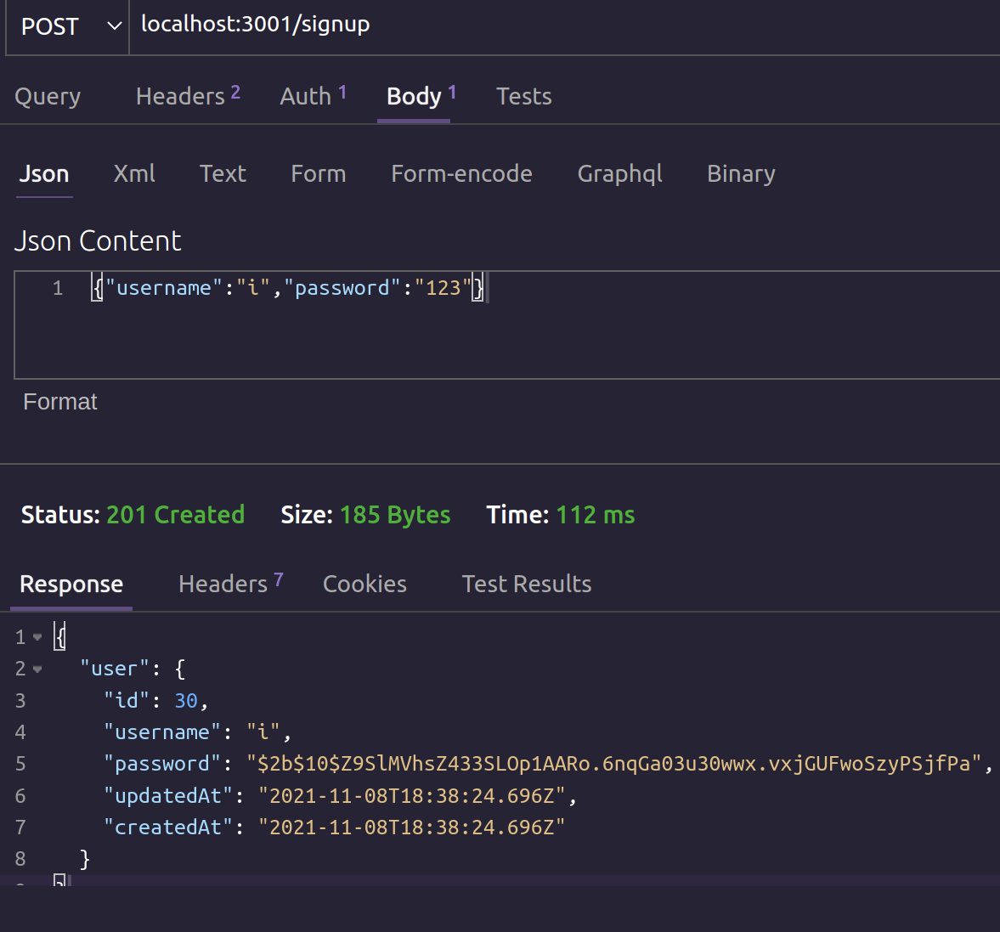
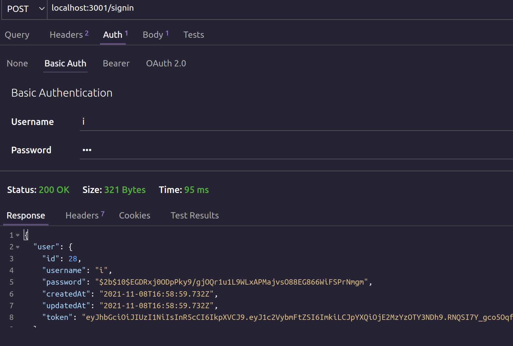
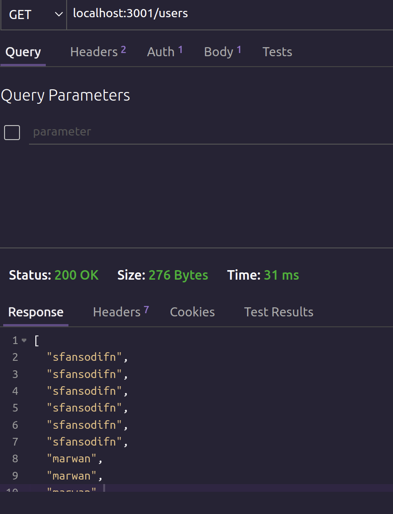
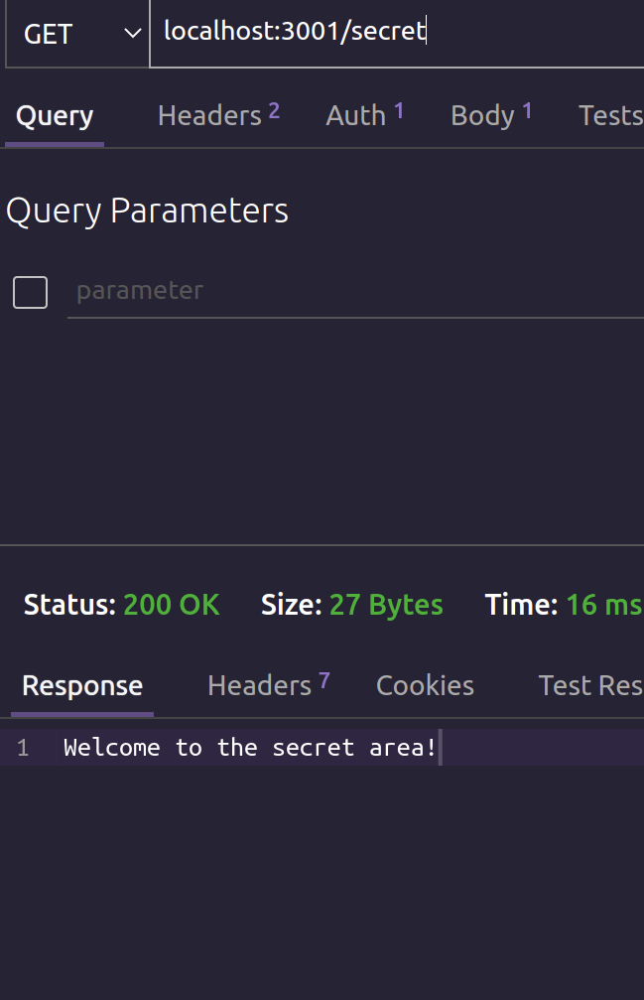

# auth-server

in todays lab we made a server the need a token to access cretin end points like users and secret

while it worked in the local environment it broke with heroku :  
========

============
# UML digram

